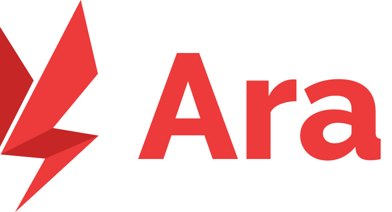

<br />
<br />
<br />
<p align="center">
  <a href="https://github.com/github_username/repo">
    
  </a>
  
  <p align="center">
    
    
    
  </p>
  
  <p align="center">
    All-new ara with modern JS, designed and developed by SPARCS
    <br />
    <a href="https://ara-beta.sparcs.org">Go to Ara</a>
  </p>
</p>

# About
new-ara 는 카이스트 교내 커뮤니티인 ARA 의 리뉴얼 프로젝트입니다. KAIST 오픈소스 동아리 SPARCS 에서 개발하고 있습니다.


## 개발
```bash
# 의존성 설치
npm install

# localhost:8080 개발 모드로 서비스
npm run serve

# Jest로 테스트
npm run test:unit
```

## 배포
```bash
# 의존성 설치
npm install

# 배포용 빌드
npm run build
```
